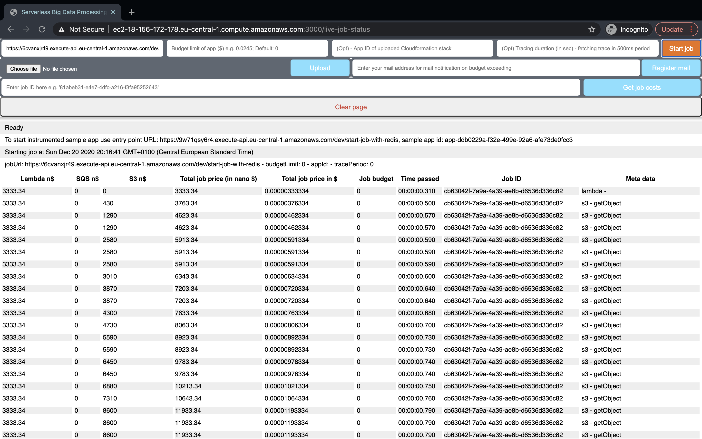

# Job Budgets for Serverless Big Data Processing

*Note: the following application is implemented and tested with `npm 6.13.4` and `node v10.19.0`*

## How to setup and run this project

Follow those steps to setup necessary AWS resources and this project with the provided scripts. You need an AWS account with your **aws_access_key_id**, **aws_secret_access_key** and a **private key** to SSH into your EC2 instance.

To use the scripts you need the [AWS CLI](https://aws.amazon.com/cli/) installed on your machine.

### How to get the aws_access_key_id and aws_secret_access_key

1. Open the AWS Console
2. On the top right click on your usename and select `My Security Credentials`

3. Under `My security credentials` > tab `AWS IAM credentials` > `Access keys for CLI, SDK, & API access` > click `Create access key`

### How to create key pair to access AWS EC2 instances
Read from official [AWS documentation](https://docs.aws.amazon.com/cli/latest/userguide/cli-services-ec2-keypairs.html) how to create a key pair.

Use the key name then when using the `./aws-resource-setup.sh` script.
You can also find the key name again in your aws account: Go to `EC2 service` > `Key pairs` section

### 1. Setup AWS resources (Security group, EC2, S3 bucket with generated test data, SNS topic, DynamoDb tables)
```bash
# chmod script to be executable
chmod 755 ./aws-resource-setup.sh

# execute script and follow instructions of that script
./aws-resource-setup.sh
```

### 2. Setup EC2 with Redis and this project

#### 2.1 SSH into your created EC2
```bash
ssh -i <link to your access key>.pem ubuntu@xxxxxxxxxx.[your AWS_REGION].compute.amazonaws.com
```

Hint: if you created a new key pair to access the EC2 instance before, you need to change permission on the `.pem` key file before using it to ssh into the instance

```bash
chmod 400 <link to your access key>.pem
```

#### 2.2 Create a file on your ec2 instance
```bash
vim ec2-instance-setup.sh
```

#### 2.3 Copy content from `./ec2-instance-setup.sh` from this repo to file on your EC2 instance and save

#### 2.4 Change file modes to be able to run script
```bash
chmod 755 ./ec2-instance-setup.sh
```

#### 2.5 Execute script and follow script instructions
```bash
./ec2-instance-setup.sh
```


After all installation, Redis server should be running on Port `6379` and job budget application on Port `3000`

### 3. Test whether you get response of running server and Redis by curl endpoint

```bash
# Test budget control Node app on EC2 on port 3000
# should return pong {"pong":"Hello world!"}
curl <ec-2-instance>.<region>.compute.amazonaws.com:3000/ping

# Test Redis by creating entry through the budget control app
# Running curl will create an entry in Redis
# should return created entry {"hello":"world"}
curl -X POST <ec-2-instance>.<region>.compute.amazonaws.com:3000/redis-test

# On your ec2 instance you can check in Redis for data existence

redis-cli -a <your Redis password>
keys * # should print out "hello" key
get hello # should print out "world"
```

You can also visit the frontend of the deployed *budget control system* on the EC2 instance on port 3000 with endoint `/live-job-status`:

```bash
# Format of adress
<Public IPv4 address>.<aws region>.compute.amazonaws.com:3000/live-job-status
```

### 4. Edit serverless.yml of the sample Serverless Big Data Processing application with Redis env vars

**IMPORTANT STEPS:**

In `./sbdp_example_app_gsd_index_calculator/serverless.yml`

Edit `REDIS_HOST: xx.xxx.xx.xxx` and `REDIS_CONNECTION: 'redis://:<your redis password>@xx.xxx.xx.xxx:6379'` with your `EC2 Public IPv4 address`

As well as `REDIS_PASSWORD` with your previous set redis password from the script. (If you forgot your previous set passwort run `cat ~/redis-stable/redis.conf | grep "requirepass "` inside the EC2 instance. This will print it out again.)

### 5. Deploy Serverless Big Data Processing application and start tracing job

To deploy the serverless data processing application install the [*Serverless framework*](https://www.serverless.com/framework/docs/getting-started/) first and then:

```bash
cd ./sbdp_example_app_gsd_index_calculator/

npm i

sls deploy --aws-profile [PROFILE] # get `https://xxxxxx.amazonaws.com/dev/start-job-with-redis` function endpoint of a instrumented SBDP (https://xxxxxx.amazonaws.com/dev/start-job-with-redis)
```


Visit `http://<EC2 Public address>:<PORT>/live-job-status` (Default port *3000*) to see continuous cost tracing in the frontend (or trough output console logs of EC2 instance)

Start serverless data processing through tracing app on the frontend or by curl command:

```bash
# Replace <> with your endoints
curl -X POST http://<your EC2 public endpoint>:3000/start-tracing -H "Content-Type: application/json" -d '{"jobUrl": "https://<your deployed data processing app start-job endpoint>", "budgetLimit": 0.0248}'

# e.g:
curl -X POST ec2-18-192-00-00.eu-central-1.compute.amazonaws.com:3000/start-tracing -H "Content-Type: application/json" -d '{"jobUrl": "https://17d8y00000.execute-api.eu-central-1.amazonaws.com/dev/start-job", "budgetLimit": 0.0248}'
```

Example screenshot of frontend of budget control system in action:



## Additional info:
A [step-by-step instruction](./step-by-step-instruction.md) to setup all AWS resources and more informations can be found [here](./step-by-step-instruction.md).

### Running the budget control system locally
If you want to run the budget control system locally you still need to deploy the Redis instance on the EC2 instance to be able to store the trace data. Follow step 1. and 2.

After that create an `.env` file in `./budget_control_system-trace_backend/` with the following content:

```bash
AWS_RESOURCE_REGION=<your AWS region where you deployed the app>
REDIS_CONNECTION=redis://:<your redis password>@<your EC2 public endpoint>:6379
SNS_TOPIC_ARN=<the SNS arn to send mails - created by the script>
```
**IMPORTANT:** `REDIS_CONNECTION` is necessary to be able to connect to the trace storage

### If you closed the Redis server and NodeJS app you can restart those services by running:

```bash
# to make script executable
chmod 755 start-app-script.sh

./start-app-script.sh
```

### Troubleshoot: Find your AWS access key, AWS secret, AWS Default region and Redis password on your EC2 instance

```bash
cat ~/.aws/credentials

cat ~/SBDP_job_budgets/budget_control_system-trace_backend/.env

cat ~/redis-stable/redis.conf | grep "requirepass "
```

### Resources created with the `./aws-resource-setup.sh`

- EC2 instance
- EC2 security group with name: `job-budget-security-group`
- SNS Topic: `job-budget-alarm`
- DynamoDB tables: `app-register-store` and `job-trace-record`
- S3 bucket: `test-task-update-data-v2`
