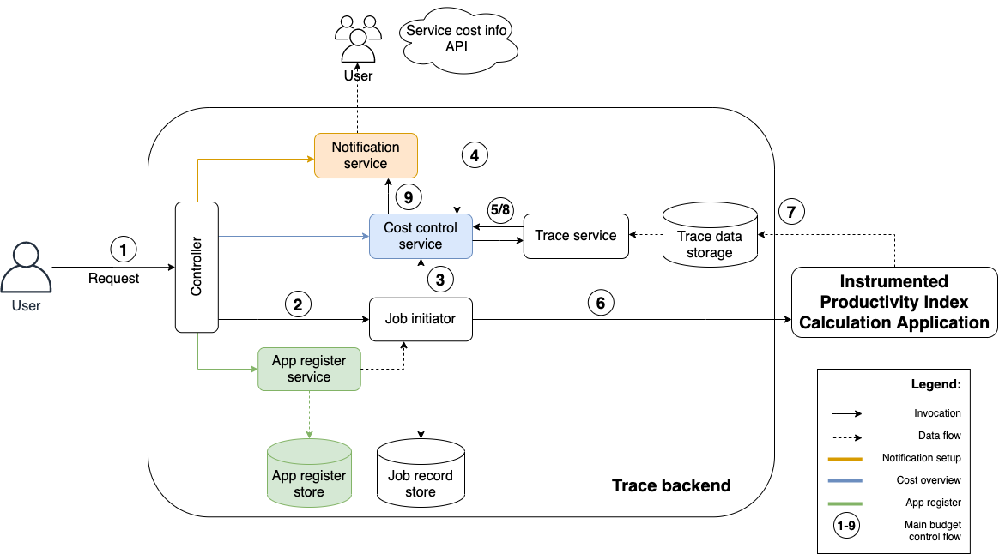

# Budget control system

## About this project

### Start app


You can start the app on a specific port with the env var `PORT`
```bash
PORT=8080 npm run start
```

## System design


## API endpoints

HTTP Method | Endpoint | Info
------------ | ------------- | -------------
POST | /register-app | Uploading CloudFormation file to save app configuration in system
POST | /subscribe-budget-alarm | Subscribes email to notification service
POST | /start-tracing | Starts SBDP job with cost tracing and saves job details in store
GET | /get-app-info/:appId | Get app configuration of saved app per app ID as parameter
GET | /get-job-info/:jobId | Get job start details through job ID parameter
GET | /job-status/:jobId | Get current job costs through job ID parameter
GET | /live-job-status | Serving static HTML site (front end) as presentation layer for easier usage with an User Interface
