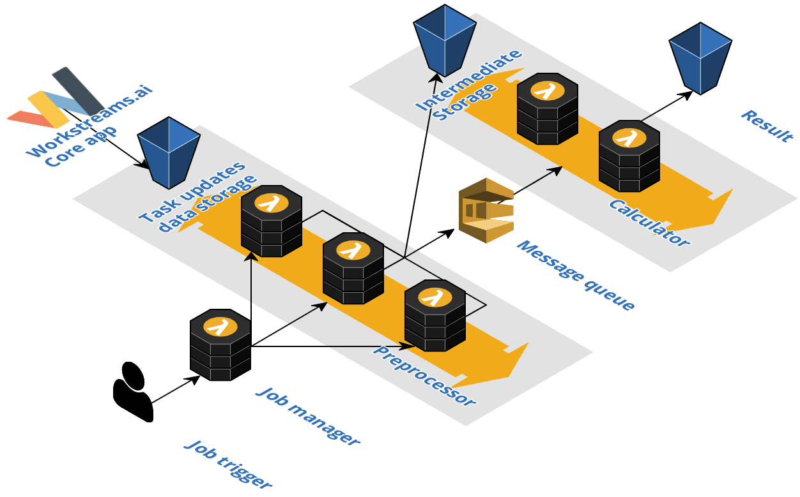

# Instrumented Serverless Big Data Processing application

## About
This is a sample `Serverless Big Data Processing application` in a task management context for the evaluation purpose of the `budget control system`. The application calculates from task data a productivity index, called *'Get-Stuff-Done'-Index (GSD)*. The index represents the average time to complete the tasks.

There are 3 versions of the same application:

- version without any tracing
- version with AWS X-Ray tracing approach in trace library
- version with own tracing approach with Redis implementation in trace library

The following figure shows the system architecture:



## Deploy whole serverless app
```bash
sls deploy --aws-profile [PROFILE NAME]

e.g 
sls deploy --aws-profile duc
```

## Deploy only function without whole setup
```bash
sls deploy function -f calculate --aws-profile duc
```
*Hint: If `./serverless.yml` is changed you need to use `sls deploy`*

## Invoke function
```bash
serverless invoke --function cleanup --log --aws-profile duc
```

## Logging functions
```bash
sls logs -f calculate -t --aws-profile duc
 
sls logs -f preprocess1k -t --aws-profile duc
sls logs -f calculate1k -t --aws-profile duc
sls logs -f start-job -t --aws-profile duc
```


# How to use
## Generate test data and store in S3

Generate test data with the script in `../test_data_generator/scripts/1-generate-task-data.js`

Check out the command in `../test_data_generator/README.md` to create data files on your machine.

Store generated data files in root of S3 bucket and rename in `./serverless.yml` the custom variable `S3_BUCKET` to your S3 bucket name.
Within the S3 bucket create a folder and rename in `./serverless.yml` the custom variable `S3_SUBRESULT_FOLDER` to your folder name.
Within the S3 bucket create the result folder and rename in `./serverless.yml` the custom variable `S3_PIPELINE_RESULT_FOLDER` to your folder name.

Your S3 bucket should have this structure
```
[S3_BUCKET]
    ├── test-data-1.json
    ├── test-data-2.json
    ├── ...
    ├── [S3_SUBRESULT_FOLDER]
    └── [S3_PIPELINE_RESULT_FOLDER]
```

*Currently the data file names are hardcoded in the `job_manager.js` files. For testing with files with different filenames please edit the input array with your test data file names in `job_manager.js`*

## Serverless big data app deployment

Deploy this serverless application with
```bash
sls deploy --aws-profile [YOUR_PROFILE]
```

## Start big data processing pipeline

Trigger serverless big data processing job with `POST` request to `start-job` endpoint (endpoint is given after previous deployment command)

Example:
```bash
curl -X POST https://xxxxxxxx.execute-api.eu-central-1.amazonaws.com/dev/start-job -H "Content-Type: application/json" -d '{"jobId":"value1"}'
```

After the job you should see the subresults and result of the processing in your `S3_SUBRESULT_FOLDER` and `S3_PIPELINE_RESULT_FOLDER` folders in your prevously defined S3 bucket.

## Cleanup intermediate storage of big data pipeline and result folder

There is a helper function to clean up the S3 folder which are used for the pipeline

```bash
sls invoke -f cleanup --aws-profile [YOUR_PROFILE]
```
